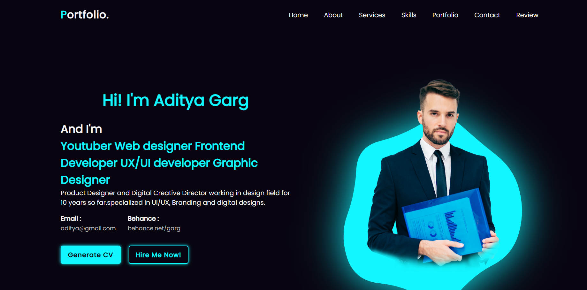
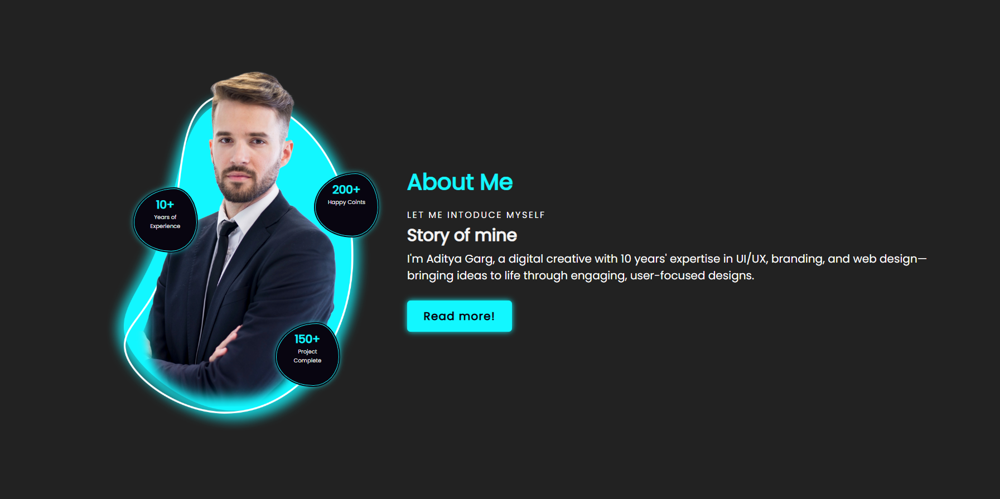
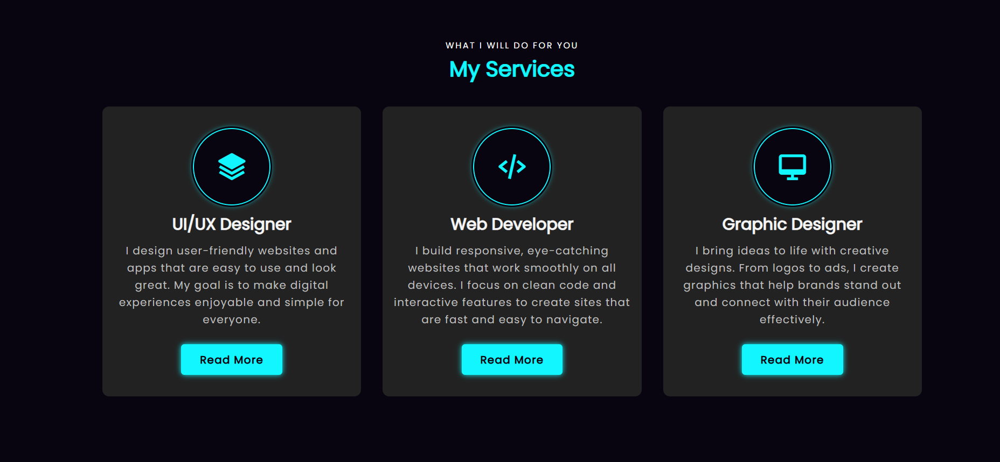

<h1>🌟 Portfolio Website </h1>

<strong>Portfolio Website</strong> is designed to highlight our skills, projects, and professional background.  
It uses clean, accessible, and mobile-friendly web design principles to ensure the best user experience across devices.

<h2>✨ Key Features</h2>
<ul>
  <li>🔸 Modern UI/UX – Minimalist and responsive design that adapts to all screen sizes.</li>
  <li>🔸 Home page with personal introduction</li>
  <li>🔸 Projects section showcasing our work</li>
  <li>🔸 Smooth scrolling and animations</li>
</ul>

<h2>🛠 Tech Stack</h2>
<ul>
  <li><strong>Frontend</strong>: HTML, CSS, Js</li>
</ul>

<h2>🚀 Getting Started</h2>

<pre><code># Clone the repository
git clone https://github.com/sambhav-2005/Portfolio_Website.git
cd Portfolio_Website
</code></pre>

<h2>🧑‍💻 Contributing</h2>

We welcome your contributions! If you have ideas to enhance Portfolio_Website, feel free to fork the repo, open issues, or submit pull requests.
Your creative ideas and suggestions would be very helpful to us. These will help us to add many more new features to make our website more visually appealing.

<h2>🌐 Live Demo</h2>

🔗 <a href="https://sambhav-2005.github.io/Portfolio_Website/"> View Live Website </a>

<h2>📬 Contact</h2>

Have questions or feedback? 
📧 Email: <a href="https://mail.google.com/">rehaannarang10102006@gmail.com</a>  
📧 Email: <a href="https://mail.google.com/">asijaparag5@gmail.com</a>  
📧 Email: <a href="https://mail.google.com/">narulasambhav24@gmail.com</a>  
📧 Email: <a href="https://mail.google.com/">sarthimahajan18@gmail.com</a> 

⭐ <strong>If you love our Portfolio website and clean code, give Portfolio_Website a star!</strong>

## 🖼 Project Preview

### Homepage

### About me 

### My Services
 
